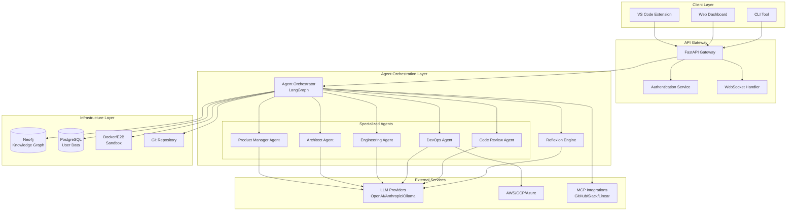
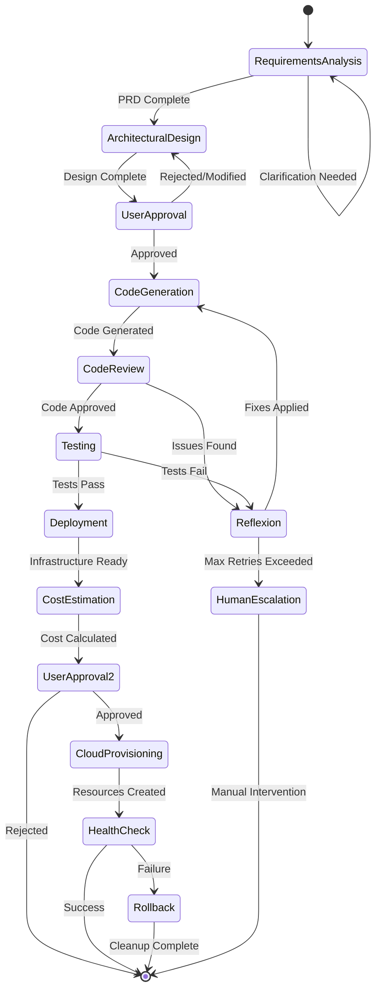

# Design Document: Autonomous Software Foundry

## Overview

The Autonomous Software Foundry is a sophisticated multi-agent ecosystem that transforms natural language requirements into fully deployed production applications. The system leverages a hierarchical agent architecture orchestrated by LangGraph, with specialized agents handling distinct phases of the software development lifecycle.

The foundry addresses critical limitations in current LLM-based coding tools by providing:

- **Persistent Project Memory**: Neo4j knowledge graph maintains semantic understanding of code relationships and dependencies
- **Execution Feedback Loops**: Reflexion engine automatically detects and corrects errors through iterative execution
- **Autonomous Cloud Deployment**: AWS CDK-based infrastructure provisioning with cost estimation and security scanning
- **Multi-Agent Specialization**: Domain-specific agents (Product Manager, Architect, Engineering, DevOps, Code Review) with optimized prompts and models

The system operates through a four-phase workflow: **Planning → Approval → Execution → Deployment**, with human-in-the-loop controls at critical decision points.

## Architecture

### High-Level Architecture



### Agent Orchestration Architecture

The system uses LangGraph for stateful, cyclic workflows with built-in checkpointing and human-in-the-loop interactions. Each agent is a node in the graph, with edges representing communication and control flow.



### Technology Stack

**Core Framework:**
- **Backend**: FastAPI (Python) for high-performance async API
- **Agent Orchestration**: LangGraph for multi-agent workflow management
- **Database**: PostgreSQL for user data, Neo4j for knowledge graph
- **Caching**: Redis for session management and caching
- **Message Queue**: Celery with Redis for background tasks

**Infrastructure:**
- **Containerization**: Docker for development, Kubernetes for production
- **Cloud Deployment**: AWS CDK (TypeScript/Python) as primary, Terraform for multi-cloud
- **Monitoring**: Prometheus + Grafana for metrics, OpenTelemetry for tracing
- **Logging**: Structured JSON logging with ELK stack integration

**Client Technologies:**
- **VS Code Extension**: TypeScript with WebSocket communication
- **Web Dashboard**: React with real-time updates via WebSockets
- **CLI Tool**: Python Click framework for headless operation

## Components and Interfaces

### Agent Orchestrator

The Agent Orchestrator is the central coordination layer built on LangGraph, managing the lifecycle and interactions of all specialized agents.

**Core Responsibilities:**
- Agent lifecycle management (instantiation, scheduling, termination)
- State synchronization across agents
- Dependency-aware task scheduling
- Human-in-the-loop workflow management
- Error handling and escalation

**Key Interfaces:**

```python
class AgentOrchestrator:
    def create_project(self, requirements: str, user_id: str) -> ProjectContext
    def assign_task(self, task: Task, agent_type: AgentType) -> TaskResult
    def synchronize_state(self, project_id: str) -> ProjectState
    def handle_approval_request(self, request: ApprovalRequest) -> ApprovalResponse
    def escalate_error(self, error: AgentError) -> EscalationResult
```

**State Management:**
- Project state stored in Neo4j with versioning
- Agent states checkpointed for recovery
- Approval workflows with timeout handling
- Conflict resolution through dependency analysis

### Specialized Agents

#### Product Manager Agent

Transforms natural language requirements into structured Product Requirements Documents (PRDs).

**Capabilities:**
- Natural language processing for requirement extraction
- Ambiguity detection and clarification question generation
- PRD generation with functional/non-functional requirements
- Requirements change impact analysis

**Model Selection:** GPT-4, Claude 3.5 Sonnet, or Llama 3.1 70B for strong reasoning

**Interface:**
```python
class ProductManagerAgent:
    def analyze_requirements(self, input: str) -> RequirementsAnalysis
    def generate_clarifying_questions(self, analysis: RequirementsAnalysis) -> List[Question]
    def create_prd(self, requirements: RequirementsAnalysis) -> PRD
    def update_prd(self, changes: RequirementChanges) -> PRD
```

#### Architect Agent

Designs system architecture, selects technology stacks, and defines component relationships.

**Capabilities:**
- System architecture design with scalability considerations
- Technology stack selection based on requirements and constraints
- Database schema design and API interface definition
- File structure organization following best practices
- Architectural decision documentation with rationale

**Model Selection:** GPT-4 or Claude 3.5 Sonnet for complex reasoning

**Interface:**
```python
class ArchitectAgent:
    def design_architecture(self, prd: PRD) -> SystemArchitecture
    def select_technology_stack(self, requirements: Requirements) -> TechStack
    def design_database_schema(self, data_requirements: DataRequirements) -> DatabaseSchema
    def create_api_specification(self, architecture: SystemArchitecture) -> APISpec
    def organize_file_structure(self, architecture: SystemArchitecture) -> FileStructure
```

#### Engineering Agent

Generates clean, maintainable code following architectural specifications.

**Capabilities:**
- Frontend and backend code generation
- Consistent naming conventions and coding standards
- Error handling and input validation implementation
- Security best practices integration
- Component integration and dependency management

**Model Selection:** Code-specialized models (GPT-4, Claude 3.5 Sonnet, Qwen 2.5 Coder, DeepSeek Coder V2)

**Interface:**
```python
class EngineeringAgent:
    def generate_code(self, specification: CodeSpecification) -> GeneratedCode
    def implement_component(self, component: ComponentSpec) -> ComponentImplementation
    def integrate_components(self, components: List[Component]) -> IntegratedSystem
    def apply_security_measures(self, code: Code) -> SecureCode
    def generate_tests(self, code: Code) -> TestSuite
```

#### DevOps Agent

Handles cloud infrastructure provisioning, deployment automation, and cost management.

**Capabilities:**
- AWS CDK infrastructure generation (TypeScript/Python)
- Multi-cloud support (experimental GCP/Azure via Terraform)
- Cost estimation and optimization
- Security scanning and compliance checking
- Deployment automation with health checks

**Model Selection:** Infrastructure-aware models (GPT-4, Claude 3.5 Sonnet)

**Interface:**
```python
class DevOpsAgent:
    def generate_infrastructure(self, architecture: SystemArchitecture) -> InfrastructureCode
    def estimate_costs(self, infrastructure: InfrastructureCode) -> CostEstimate
    def provision_resources(self, infrastructure: InfrastructureCode) -> DeploymentResult
    def perform_health_check(self, deployment: Deployment) -> HealthStatus
    def rollback_deployment(self, deployment: Deployment) -> RollbackResult
```

#### Code Review Agent

Performs automated code quality analysis, security scanning, and best practices enforcement.

**Capabilities:**
- Security vulnerability detection (OWASP Top 10, dependency scanning)
- Code quality analysis (complexity, maintainability, performance)
- Best practices enforcement (framework conventions, accessibility)
- Automated fix suggestions with explanations
- Quality metrics tracking over time

**Model Selection:** GPT-4 or Claude 3.5 Sonnet for comprehensive analysis

**Interface:**
```python
class CodeReviewAgent:
    def analyze_code(self, code: Code) -> CodeAnalysis
    def detect_security_issues(self, code: Code) -> List[SecurityIssue]
    def check_best_practices(self, code: Code) -> List[BestPracticeViolation]
    def suggest_improvements(self, analysis: CodeAnalysis) -> List[Improvement]
    def generate_quality_report(self, analysis: CodeAnalysis) -> QualityReport
```

### Reflexion Engine

The self-healing system that automatically detects and corrects errors through iterative execution.

**Core Workflow:**
1. **Execute**: Run generated code in sandboxed environment
2. **Analyze**: Capture errors, logs, and execution context
3. **Fix**: Generate corrective modifications using error analysis
4. **Retry**: Re-execute with fixes applied
5. **Escalate**: Hand off to human if max retries exceeded

**Capabilities:**
- Sandboxed code execution with resource limits
- Comprehensive error capture and analysis
- Root cause analysis using execution traces
- Automated fix generation with context awareness
- Retry logic with exponential backoff

**Interface:**
```python
class ReflexionEngine:
    def execute_code(self, code: Code, environment: SandboxEnvironment) -> ExecutionResult
    def analyze_errors(self, result: ExecutionResult) -> ErrorAnalysis
    def generate_fixes(self, analysis: ErrorAnalysis) -> List[CodeFix]
    def apply_fixes(self, code: Code, fixes: List[CodeFix]) -> Code
    def should_escalate(self, attempt_count: int, error: Error) -> bool
```

### Knowledge Graph

Neo4j-based semantic storage system maintaining project relationships and dependencies.

**Schema Design:**

```cypher
// Core Node Types
(:Project {id, name, created_at, status})
(:Component {id, name, type, file_path})
(:Function {id, name, signature, complexity})
(:Class {id, name, inheritance_chain})
(:Database {id, name, schema})
(:API {id, endpoint, method, parameters})
(:Dependency {id, name, version, type})

// Relationship Types
(:Project)-[:CONTAINS]->(:Component)
(:Component)-[:DEPENDS_ON]->(:Component)
(:Function)-[:CALLS]->(:Function)
(:Class)-[:INHERITS_FROM]->(:Class)
(:API)-[:USES]->(:Database)
(:Component)-[:REQUIRES]->(:Dependency)
```

**Capabilities:**
- Semantic code relationship tracking
- Dependency impact analysis
- Context-aware code search
- Refactoring safety analysis
- Project knowledge persistence

**Interface:**
```python
class KnowledgeGraph:
    def store_component(self, component: Component, project_id: str) -> None
    def find_dependencies(self, component_id: str) -> List[Dependency]
    def analyze_impact(self, change: CodeChange) -> ImpactAnalysis
    def search_similar_patterns(self, pattern: CodePattern) -> List[Match]
    def get_project_context(self, project_id: str) -> ProjectContext
```

### Sandbox Environment

Secure, isolated execution environment for code testing and validation.

**Security Features:**
- Complete host system isolation using Docker containers or E2B
- Resource limits (2 vCPUs, 4GB RAM, 2GB disk, 5-minute execution time)
- Network restrictions (outbound HTTPS/HTTP only, internal ranges blocked)
- System call filtering to prevent container escape
- Malware scanning on dependency installation

**Performance Optimizations:**
- Cached base images with pre-installed toolchains
- Layer caching for common dependencies
- Parallel execution for independent tests
- Resource monitoring and automatic cleanup

**Interface:**
```python
class SandboxEnvironment:
    def create_sandbox(self, language: str, dependencies: List[str]) -> Sandbox
    def execute_code(self, sandbox: Sandbox, code: Code) -> ExecutionResult
    def install_dependencies(self, sandbox: Sandbox, deps: List[str]) -> InstallResult
    def cleanup_sandbox(self, sandbox: Sandbox) -> None
    def get_resource_usage(self, sandbox: Sandbox) -> ResourceUsage
```

## Data Models

### Core Domain Models

```python
@dataclass
class Project:
    id: str
    name: str
    description: str
    user_id: str
    status: ProjectStatus
    created_at: datetime
    updated_at: datetime
    configuration: ProjectConfiguration
    
@dataclass
class ProjectConfiguration:
    approval_policy: ApprovalPolicy  # autonomous/standard/strict
    cost_threshold: float
    target_cloud: CloudProvider
    llm_preferences: Dict[AgentType, str]
    quality_gates: QualityGates

@dataclass
class Task:
    id: str
    project_id: str
    agent_type: AgentType
    specification: TaskSpecification
    status: TaskStatus
    created_at: datetime
    completed_at: Optional[datetime]
    result: Optional[TaskResult]
    
@dataclass
class CodeComponent:
    id: str
    name: str
    type: ComponentType  # class, function, module, api, database
    file_path: str
    content: str
    dependencies: List[str]
    metadata: Dict[str, Any]
    
@dataclass
class DeploymentManifest:
    id: str
    project_id: str
    infrastructure_code: str
    estimated_cost: CostEstimate
    provisioned_resources: List[AWSResource]
    health_status: HealthStatus
    deployment_url: Optional[str]
```

### Agent Communication Models

```python
@dataclass
class AgentMessage:
    sender: AgentType
    recipient: AgentType
    message_type: MessageType
    payload: Dict[str, Any]
    timestamp: datetime
    correlation_id: str

@dataclass
class ApprovalRequest:
    id: str
    project_id: str
    request_type: ApprovalType  # plan, deployment, cost_override
    content: ApprovalContent
    estimated_cost: Optional[float]
    timeout: datetime
    
@dataclass
class ExecutionResult:
    success: bool
    stdout: str
    stderr: str
    exit_code: int
    execution_time: float
    resource_usage: ResourceUsage
    errors: List[ExecutionError]
```

### Knowledge Graph Models

```python
@dataclass
class GraphNode:
    id: str
    labels: List[str]
    properties: Dict[str, Any]
    
@dataclass
class GraphRelationship:
    id: str
    start_node: str
    end_node: str
    type: str
    properties: Dict[str, Any]
    
@dataclass
class DependencyGraph:
    nodes: List[GraphNode]
    relationships: List[GraphRelationship]
    
@dataclass
class ImpactAnalysis:
    affected_components: List[str]
    risk_level: RiskLevel
    recommended_actions: List[str]
    test_requirements: List[str]
```

## Error Handling

### Error Classification

**System Errors:**
- Agent communication failures
- Database connectivity issues
- External service timeouts
- Resource exhaustion

**Code Errors:**
- Compilation/syntax errors
- Runtime exceptions
- Test failures
- Dependency conflicts

**Infrastructure Errors:**
- Cloud provisioning failures
- Network connectivity issues
- Permission/authentication errors
- Resource quota exceeded

**Business Logic Errors:**
- Invalid requirements
- Architectural inconsistencies
- Security policy violations
- Cost threshold exceeded

### Error Recovery Strategies

**Automatic Recovery:**
- Retry with exponential backoff for transient failures
- Fallback to alternative LLM providers
- Graceful degradation when non-critical services fail
- Circuit breaker pattern for external dependencies

**Reflexion Engine Recovery:**
- Maximum 5 retry attempts for code errors
- Context-aware fix generation using error traces
- Progressive complexity in fix attempts
- Automatic escalation after max retries

**Infrastructure Recovery:**
- Automatic rollback on deployment failures
- Resource cleanup for partial provisioning
- State preservation during recovery
- Health check validation before completion

**Human Escalation:**
- Clear error context and suggested actions
- Preserved system state for debugging
- Option to resume from last checkpoint
- Detailed logs and traces for analysis

### Error Monitoring and Alerting

**Structured Logging:**
```json
{
  "timestamp": "2024-01-15T10:30:00Z",
  "level": "ERROR",
  "agent": "engineering_agent",
  "project_id": "proj_123",
  "user_id": "user_456",
  "operation": "code_generation",
  "error_type": "compilation_error",
  "error_message": "Syntax error in generated TypeScript",
  "context": {
    "file": "src/components/UserForm.tsx",
    "line": 42,
    "attempt": 3
  },
  "trace_id": "trace_789"
}
```

**Alert Rules:**
- Agent failure rate > 10% over 5 minutes
- Deployment failure rate > 5% over 1 hour
- Average task duration > 2x baseline
- Cost threshold exceeded
- Security vulnerability detected

## Testing Strategy

### Dual Testing Approach

The system employs both unit testing and property-based testing for comprehensive coverage:

**Unit Testing:**
- Specific examples and edge cases
- Integration points between agents
- Error conditions and boundary cases
- Mock external dependencies for isolation

**Property-Based Testing:**
- Universal properties across all inputs
- Comprehensive input coverage through randomization
- Minimum 100 iterations per property test
- Each test tagged with design document property reference

### Testing Framework Selection

**Python Components:**
- **Unit Tests**: pytest with fixtures and mocking
- **Property Tests**: Hypothesis for property-based testing
- **Integration Tests**: pytest with Docker containers
- **Load Tests**: Locust for performance testing

**TypeScript Components:**
- **Unit Tests**: Jest with comprehensive mocking
- **Property Tests**: fast-check for property-based testing
- **Integration Tests**: Playwright for end-to-end testing
- **Type Tests**: tsd for TypeScript definition testing

### Quality Gates

**Pre-Deployment Requirements:**
- All tests pass (unit, integration, property-based)
- Code coverage ≥ 80%
- Security scan clean (no critical/high vulnerabilities)
- Linting passes (ESLint, Pylint, mypy)
- Performance benchmarks within SLA thresholds

**Property Test Configuration:**
- Minimum 100 iterations per property
- Shrinking enabled for minimal counterexamples
- Deterministic seeds for reproducible failures
- Tagged with feature and property references

**Example Property Test Tag:**
```python
@given(st.text(), st.integers())
def test_code_generation_preserves_functionality(requirements, seed):
    """
    Feature: autonomous-software-foundry, Property 1: Generated code preserves functional requirements
    """
    # Property test implementation
```

The testing strategy ensures both concrete correctness through examples and universal correctness through property-based validation, providing comprehensive quality assurance for the autonomous software foundry system.

## Correctness Properties

*A property is a characteristic or behavior that should hold true across all valid executions of a system—essentially, a formal statement about what the system should do. Properties serve as the bridge between human-readable specifications and machine-verifiable correctness guarantees.*

### Property 1: Agent Instantiation and Routing
*For any* project requirements, the Agent_Orchestrator should instantiate the appropriate specialized agents based on project characteristics and route tasks to the most suitable agent type.
**Validates: Requirements 1.1, 1.5**

### Property 2: Agent Communication Consistency
*For any* agent communication scenario, message passing should result in proper state synchronization and notification propagation to all dependent agents.
**Validates: Requirements 1.2, 1.4**

### Property 3: Conflict-Free Task Scheduling
*For any* set of concurrent agent tasks with overlapping dependencies, the orchestrator should schedule them without conflicts through dependency-aware coordination.
**Validates: Requirements 1.3**

### Property 4: Natural Language Processing Accuracy
*For any* natural language requirements input, the Product_Manager_Agent should correctly identify core functionality and generate appropriate clarifying questions for ambiguous content.
**Validates: Requirements 2.1, 2.2**

### Property 5: Comprehensive PRD Generation
*For any* sufficiently detailed requirements, the Product_Manager_Agent should generate a complete PRD containing functional requirements, non-functional requirements, and acceptance criteria.
**Validates: Requirements 2.3, 2.4**

### Property 6: Change Propagation Consistency
*For any* requirement changes during development, PRD updates should be properly propagated to all affected agents with consistent state updates.
**Validates: Requirements 2.5**

### Property 7: Complete Architecture Design
*For any* PRD input, the Architect_Agent should generate a comprehensive system architecture including component relationships, technology stack selection, database schemas, API interfaces, and data flow patterns.
**Validates: Requirements 3.1, 3.2, 3.3**

### Property 8: Best Practice Code Organization
*For any* generated file structure, it should follow industry best practices and conventions for the selected technology stack with proper documentation and rationale.
**Validates: Requirements 3.4, 3.5**

### Property 9: Specification-Compliant Code Generation
*For any* architectural specification, the Engineering_Agent should generate code that adheres to the specifications and includes both frontend and backend components as required.
**Validates: Requirements 4.1, 4.3**

### Property 10: Comprehensive Code Quality
*For any* generated code, it should maintain consistent naming conventions, coding standards, documentation, error handling, input validation, and security measures throughout.
**Validates: Requirements 4.2, 4.4**

### Property 11: Component Integration Consistency
*For any* set of interdependent code components, they should integrate correctly with proper dependency resolution and interface compatibility.
**Validates: Requirements 4.5**

### Property 12: Sandboxed Execution Verification
*For any* generated code, the Reflexion_Engine should execute it in a sandboxed environment and capture comprehensive execution results including success status and resource usage.
**Validates: Requirements 5.1**

### Property 13: Comprehensive Error Analysis and Correction
*For any* execution error, the Reflexion_Engine should capture detailed error information, analyze root causes, generate appropriate fixes, and verify corrections through re-execution.
**Validates: Requirements 5.2, 5.3, 5.4**

### Property 14: Escalation After Max Retries
*For any* error correction scenario, if multiple correction attempts fail (exceeding 5 retries), escalation to human intervention should occur with detailed error context.
**Validates: Requirements 5.5, 22.1**

### Property 15: Knowledge Graph Consistency
*For any* code generation or modification, semantic relationships should be stored in the knowledge graph and maintained accurately during refactoring operations.
**Validates: Requirements 6.1, 6.4**

### Property 16: Comprehensive Dependency Analysis
*For any* proposed code change, the knowledge graph should identify all affected components and provide complete relevant context including related code, documentation, and dependencies.
**Validates: Requirements 6.2, 6.3**

### Property 17: Dual Search Capability
*For any* code pattern search query, the knowledge graph should support both semantic and syntactic searches across the entire codebase.
**Validates: Requirements 6.5**

### Property 18: CDK Infrastructure Generation
*For any* infrastructure requirements, the DevOps_Agent should generate AWS CDK code in TypeScript or Python, perform synthesis validation, and handle environment bootstrapping as needed.
**Validates: Requirements 7.1, 7.2, 7.3**

### Property 19: Complete Resource Provisioning
*For any* CDK deployment, all necessary AWS resources should be provisioned correctly and deployment outputs (CfnOutput values) should be captured and returned.
**Validates: Requirements 7.4, 7.5**

### Property 20: Resource Cleanup Completeness
*For any* project deletion request, all associated cloud resources should be completely removed through CDK destroy operations.
**Validates: Requirements 7.6**

### Property 21: Comprehensive Security Scanning
*For any* generated code, automated secret scanning should detect hardcoded credentials using pattern matching and entropy analysis, automatically replace them with environment variable references, and prevent code delivery until security issues are resolved.
**Validates: Requirements 15.1, 15.2, 15.5**

### Property 22: Secure Project Setup
*For any* new project creation, proper environment file handling should occur including .env.example generation and .gitignore configuration.
**Validates: Requirements 15.3**

### Property 23: Multi-Method Secret Detection
*For any* potential credential in code, detection should work using both pattern matching and entropy analysis methods.
**Validates: Requirements 15.4**

### Property 24: Comprehensive Test Generation
*For any* generated code, appropriate unit tests, integration tests, and end-to-end tests should be created with minimum 80% code coverage using suitable testing frameworks for the technology stack.
**Validates: Requirements 17.1, 17.2, 17.3**

### Property 25: Quality Gate Enforcement
*For any* deployment attempt, all configured quality gates (linting, type checking, security scanning) must pass before deployment is allowed, especially for production environments.
**Validates: Requirements 17.4, 17.6**

### Property 26: Test Failure Correction Loop
*For any* test failures, the Reflexion_Engine should analyze failures, generate corrections, and re-run tests until all pass or escalation threshold is reached.
**Validates: Requirements 17.5**

### Property 27: Performance Test Generation
*For any* performance-critical application, appropriate load tests and performance benchmarks should be generated with defined SLA thresholds.
**Validates: Requirements 17.7**

### Property 28: Deployment Failure Recovery
*For any* CDK deployment failure, automatic rollback should occur through CDK destroy operations with detailed failure logs provided to users.
**Validates: Requirements 22.2**

### Property 29: Deployment State Tracking
*For any* partial cloud resource provisioning, a deployment manifest should track success/failure status of individual resources and enable targeted retry operations.
**Validates: Requirements 22.3**

### Property 30: Sandbox Security and Isolation
*For any* code execution, the sandbox environment should provide complete host system isolation using Docker containers or E2B sandboxes while blocking dangerous system calls that could enable container escape.
**Validates: Requirements 25.1, 25.4**

### Property 31: Resource Limit Enforcement
*For any* sandbox execution, all configured resource limits (CPU, memory, disk, network, execution time) should be strictly enforced.
**Validates: Requirements 25.2**

### Property 32: Cached Dependency Optimization
*For any* sandbox requiring common dependencies, cached layer images should be used to speed up initialization while maintaining security.
**Validates: Requirements 25.3**

### Property 33: Complete Execution Capture and Cleanup
*For any* sandbox execution completion, all execution data (stdout, stderr, exit codes, resource usage) should be captured and container cleanup should occur within 30 seconds.
**Validates: Requirements 25.5**

### Property 34: Automatic Code Review Triggering
*For any* completed code generation, the Code_Review_Agent should automatically analyze all generated code before presenting it to users.
**Validates: Requirements 31.1**

### Property 35: Comprehensive Code Analysis
*For any* code review, analysis should check for security issues, best practices, performance, maintainability, accessibility, and error handling with proper severity categorization (Critical, High, Medium, Low).
**Validates: Requirements 31.2, 31.3**

### Property 36: Complete Review Results
*For any* code review findings, results should include specific code locations, explanations of issues, suggested improvements, and automatic triggering of Reflexion_Engine for critical issues.
**Validates: Requirements 31.4, 31.5**
