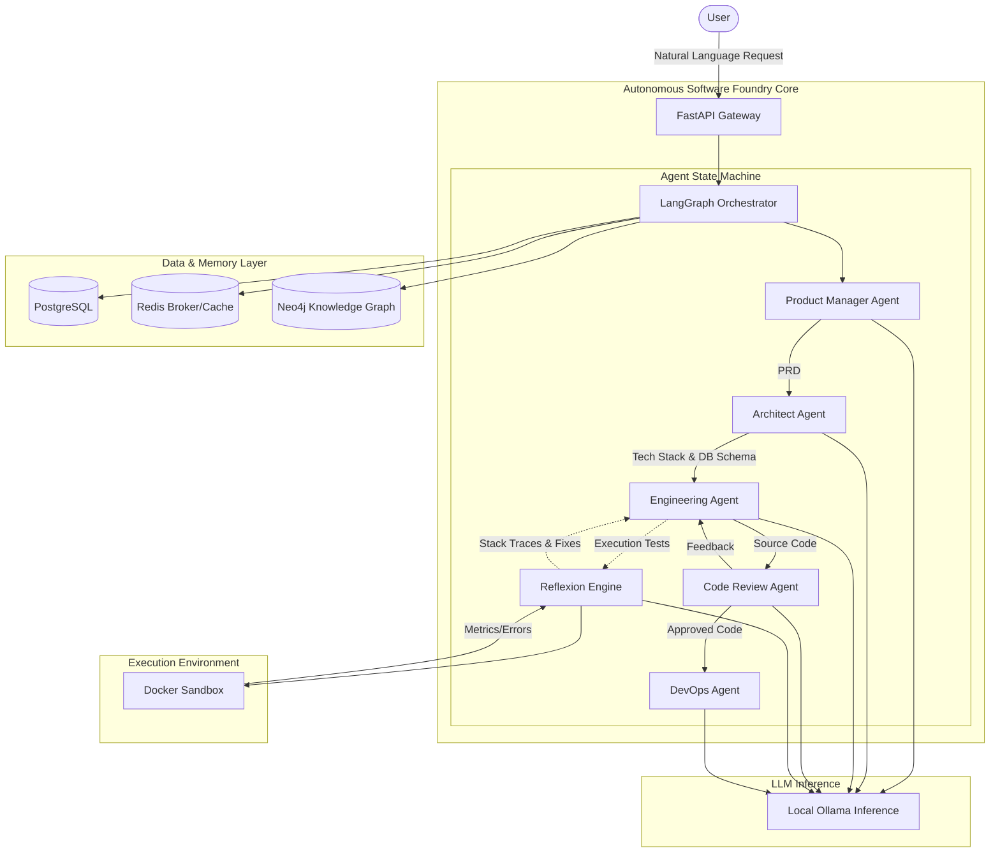
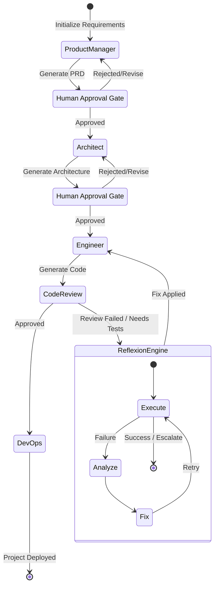
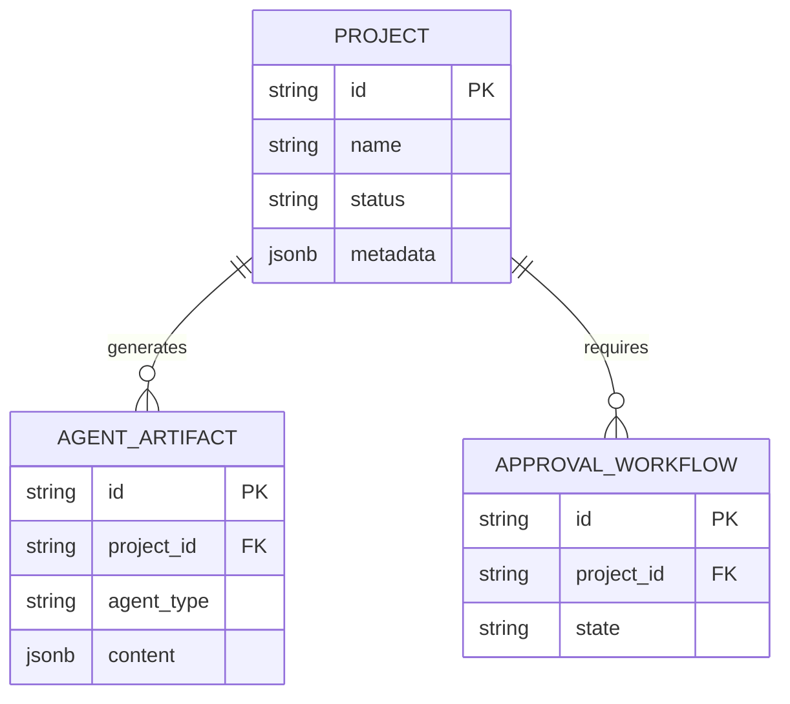

# System Architecture

## Architecture Diagram

## Overview
The Autonomous Software Foundry utilizes a multi-agent AI architecture orchestrated by LangGraph. It automates the software development lifecycle from natural language requirements parsing to code generation and self-healing execution.

## The LangGraph State Machine
The core workflow is governed by `AgentOrchestrator`, which manages a StateGraph representing the development lifecycle.

### State Transition Diagram

### Agent Workflow
1. **Product Manager Agent**: Parses user requirements and generates a detailed Product Requirements Document (PRD).
2. **Architect Agent**: Designs the system architecture, tech stack, and database schema based on the PRD.
3. **Engineering Agent**: Generates the actual source code and project scaffolding.
4. **Code Review Agent**: Reviews the generated code for quality, security vulnerabilities, and adherence to standards.
5. **Reflexion Engine**: Executes the generated code in an isolated Docker sandbox. If errors occur, it analyzes the stack traces and feeds corrections back into the loop (Execute -> Analyze -> Fix -> Retry -> Escalate).
6. **DevOps Agent**: Handles final cloud provisioning and deployment configuration.

## Data Persistence & Infrastructure

- **PostgreSQL**: Stores relational data such as project metadata, agent artifacts, and approval workflows.
- **Redis**: Serves as a message broker for Celery background tasks and as a caching layer.
- **Neo4j**: A Knowledge Graph for semantic code understanding and persistent project memory.
- **Ollama**: The primary LLM inference engine, running locally to serve Qwen2.5-Coder models for all agent reasoning and code generation tasks.

## Human-in-the-Loop Capabilities
The architecture supports pause and resume execution, as well as explicit approval gates. This allows a human developer to intercept the workflow—for example, waiting for human review of the PRD or Architecture artifacts before proceeding to the code generation phase.
